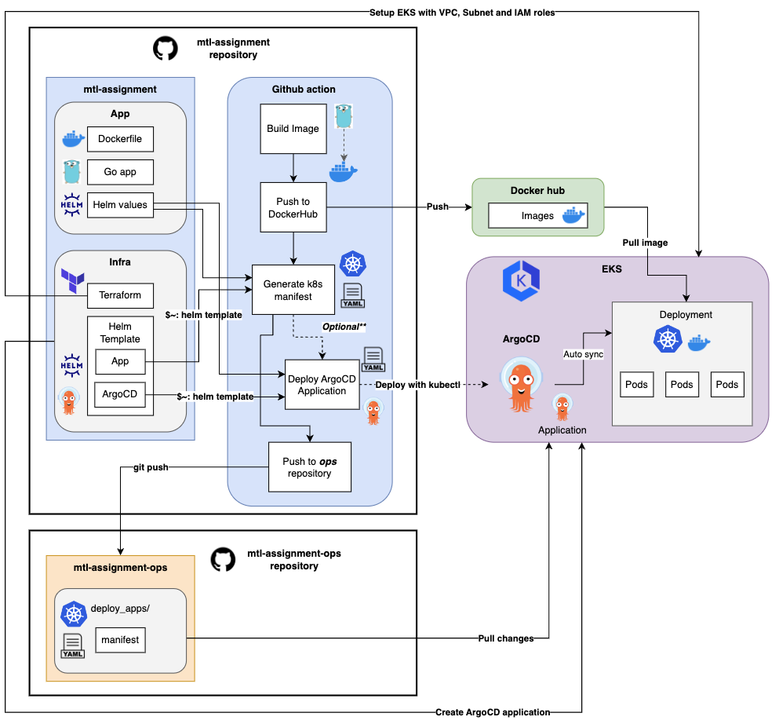
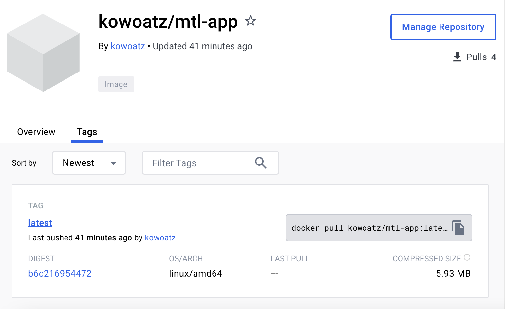
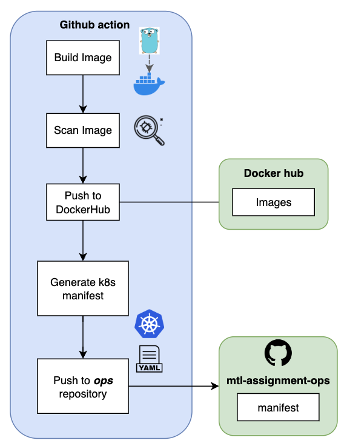

# MTL Assignment

## Diagram overview
The following diagram illustrates the architecture and workflow for the mtl assignment solution:



## 1. Dockerfile
- Dockerfile with multi-stage build.
- Reduce image size from 321MB to 5.93MB.

  ```sh
  FROM golang:1.20-alpine as builder
  WORKDIR /app
  COPY go.mod go.sum ./
  RUN go mod download && go mod tidy
  COPY . .
  RUN go build -o main .

  FROM alpine:3.8
  WORKDIR /app
  COPY --from=builder /app/main .
  EXPOSE 8080
  CMD ["/app/main"]
  ```

## 2. Docker Hub
1. Build docker image 

    ```sh
    docker build -t kowoatz/mtl-app:latest .
    ```
2. Push docker image to Docker Hub

    ```sh
    docker push kowoatz/mtl-app:latest
    ```
3. Docker Hub url for mtl-app image.

    - URL: https://hub.docker.com/r/kowoatz/mtl-app

    - Pull image from Docker Gub
      ```sh
      docker pull kowoatz/mtl-app
      ```

      

## 3. Helm chart
Helm Chart for deploying the image from Docker Hub. The chart has flexibility to allow the Developer to adjust Values without having to rebuild the chart frequently.

### Chart Sources

* `helm/go-app`: Chart with application deployment and service.
* `helm/argo-app`: Chart with argocd application (Optional).

### How to deploy the helm chart

To setup Helm Chart and publish to Chart registry:
```sh
helm package ./helm/go-app
```

```sh
helm repo add mtl-chart <YOUR_CHART_REGISTRY>
```

```sh
helm push --version=<CHART_VERSION> ./helm/go-app mtl-chart
```

To install the chart with the release name mtl-application:

```sh
helm repo add mtl-chart <YOUR_CHART_REGISTRY>
```

```sh
helm repo update
```

Use **_kubectl apply -f_** with generated file from **_helm template_** to deploying to Kubernetes with Values.yaml **_(Flexible variables file)_**

**Helm values.yaml example:**

```yaml
###### Helm value for GO app.
name: mtl-app
replicaCount: 1
image:
  repository: kowoatz/mtl-assignment-3
  tag: latest
  pullPolicy: IfNotPresent
containerPort: 8080

env:
  enabled: false
  env:
    FOO: 'BAR'

resources:
  enabled: true
  resources:
    limits:
      cpu: 200m
      memory: 512Mi
    requests:
      cpu: 100m
      memory: 250Mi

service:
  type: LoadBalancer
  port: 8080
  targetPort: 8080

###### Helm value for ArgoCD.
appName: mtl-argocd-app
project: default
destination:
  namespace: default
  server: https://kubernetes.default.svc
source:
  path: ./manifest
  repoURL: https://github.com/anuchit17219/mtl-assaignment-ops.git
  targetRevision: HEAD
automated:
  prune: true
  selfHeal: true

```
**Deploy application**

```sh
helm template --name-template mtl-application --set name=<APP_NAME> --version <CHART_VERSION> --namespace <K8S_NAMESPACE> -set image.repository=<IMAGE_NAME> --set image.tag=<IMAGE_TAG> mtl-chart/mtl-application -f values.yaml | kubectl apply -n <K8S_NAMESPACE> -f -
```

_For example, please refer to the [MTL Helm chart](https://github.com/anuchit17219/mtl-assignment/tree/main/helm/go-app)_.

## 4. EKS Cluster (Terraform)
Set up EKS cluster with related resources to run EKS like VPC, Subnet, etc. by following EKS best practices using Terraform tools.
1. Go to the Terraform directory.

   ```sh
   cd terraform/aws_eks
   ```
2. Initailze Terraform directory.

   ```sh
   terraform init
   ```
3. Validate the configuration files in a directory. 

   ```sh
   terraform validate
   ```
2. Generates a speculative execution plan, showing what actions Terraform would take to apply the current configuration.

   ```sh
   terraform plan
   ```
5. Provision or update all the resources declared in the directory and module file.

   ```sh
   terraform apply
   ```
_For example, please refer to the [MTL Terraform](https://github.com/anuchit17219/mtl-assignment/tree/main/terraform)_.

## 5. EKS Cluster access to S3 and SQS (Terraform)
### Create a Terraform module for IAM and install it with the EKS Node group.

Examples for Iam role, Iam role policy, and Iam role policy attachment for accessing S3 and SQS in Terraform format.
- S3 with permission GetObject, PutObject (S3 _ARN:arn:aws:s3:::my-web-assets_)
- SQS with permission; send, receive, delete message (SQS _ARN:arn:aws:sqs:ap-southeast-1:123456789123:lms-import-data_)

   ```yaml
  resource "aws_iam_role" "eks_cluster_iam_role" {
    name = "${var.PROJECT_NAME}-EKS-role"
    assume_role_policy = <<POLICY
  {
    "Version": "2012-10-17",
    "Statement": [
      {
        "Effect": "Allow",
        "Principal": {
          "Service": "eks.amazonaws.com"
        },
        "Action": "sts:AssumeRole"
      }
    ]
  }
  POLICY
  }

  resource "aws_iam_role_policy_attachment" "eks_cluster_policy" {
    policy_arn = "arn:aws:iam::aws:policy/AmazonEKSClusterPolicy"
    role = aws_iam_role.eks_cluster_iam_role.name
  }


  # Create IAM role for EKS Node Group
  resource "aws_iam_role" "node_group" {
    name = "${var.PROJECT_NAME}-node-group-role"
    assume_role_policy = <<POLICY
  {
    "Version": "2012-10-17",
    "Statement": [
      {
        "Effect": "Allow",
        "Principal": {
          "Service": "ec2.amazonaws.com"
        }, 
        "Action": "sts:AssumeRole"
      }
    ]
  }
  POLICY
  }

  # Create an IAM policy for the S3
  resource "aws_iam_policy" "s3" {
    name   = "${var.PROJECT_NAME}-s3-policy"
    description = "Allows access to the S3"
    policy = <<EOF
  {
    "Version": "2012-10-17",
    "Statement": [
      {
        "Action": [
          "s3:GetObject",
          "s3:PutObject"
        ],
        "Effect": "Allow",
        "Resource": "arn:aws:s3:::my-web-assets)"
      }
    ]
  }
  EOF
  }

  # Create an IAM policy for the SQS queue
  resource "aws_iam_policy" "sqs" {
    name        = "${var.PROJECT_NAME}-sqs-policy"
    description = "Allows access to the SQS queue"
    policy      = <<EOF
  {
    "Version": "2012-10-17",
    "Statement": [
      {
        "Effect": "Allow",
        "Action": [
          "sqs:SendMessage",
          "sqs:ReceiveMessage",
          "sqs:DeleteMessage"
        ],
        "Resource": "arn:aws:sqs:ap-southeast-1:123456789123:lms-import-data)"
      }
    ]
  }
  EOF
  }

  # Attach the S3 policy to the IAM role
  resource "aws_iam_role_policy_attachment" "s3" {
    policy_arn = aws_iam_policy.s3.arn
    role       = aws_iam_role.node_group.name
  }

  # Attach the SQS queue policy to the IAM role
  resource "aws_iam_role_policy_attachment" "sqs" {
    policy_arn = aws_iam_policy.sqs.arn
    role       = aws_iam_role.node_group.name
  }

   ```
## 6. ArgoCD
Use ArgoCD to deploy the Go application.

### How to deploy the ArgoCD application

1. Install ArgoCD CLI [https://github.com/argoproj/argo-cd/releases](https://github.com/argoproj/argo-cd/releases).

2. Connect to ArgoCD Server.
   ```sh
   argocd login <ARGOCD_SERVER> --username <USERNAME> --password <PASSWORD>
   ```
3. List the application managed by ArgoCD to verify whether your application already exists or not.
   ```sh
   argocd app list
   ```
4. If your application does not already exist, create a new ArgoCD deployment.
   ```sh
   argocd app create <APPLICATION_NAME> \
            --project <PROJECT_NAME>
            --repo <GIT_REPO_URL> \
            --path <PATH_TO_APPLICATION_YAML> \
            --dest-server https://kubernetes.default.svc \
            --dest-namespace <DEST_NAMESPACE> \
   ```
   **argo app create with variables:**
   ```sh
   argocd app create mtl-assignment-app \
            --project default
            --repo https://github.com/anuchit17219/mtl-assaignment-ops.git \
            --path ./manifest \
            --dest-namespace default \
            --dest-server https://kubernetes.default.svc
   ```
5. Another option to create an application is by writing a YAML file and using kubectl apply to deploy the ArgoCD application.
    
   This YAML file is generated by Helm template CLI, you can run this command to generate it.

   ```sh
   helm template mtl-assignment-argo ./helm/go-app > <ARGOCD_APPLICATION.YAML> -f values.yaml
   ```
   **ArgoCD application example:**
   _For example, please refer to the [MTL ArgoCD Helm chart](https://github.com/anuchit17219/mtl-assignment/tree/main/helm/argocd-app)_.
   ```yaml
   apiVersion: argoproj.io/v1alpha1
    kind: Application
    metadata:
      name: mtl-assignment-app
      namespace: argocd
      finalizers:
      - resources-finalizer.argocd.argoproj.io
    spec:
      project: default
      destination:
        namespace: default
        server: https://kubernetes.default.svc
      source:
        path: ./manifest
        repoURL: 'https://github.com/anuchit17219/mtl-assaignment-ops.git'
        targetRevision: HEAD
      syncPolicy:
        automated:
          prune: true
          selfHeal: true
   ```

   Deploy with generated ArgoCD application.

    ```sh
   kubectl apply -f <ARGOCD_APPLICATION.YAML>
   ```

## 7. GitHub Actions CI/CD Workflow
Github action workflow for deploying applications with GitOps.



1. Build an image from the Dockerfile and go code.
2. Run an image vulnerability scanner for bugs or vulnerability detection.
3. Push the image to Docker Hub
4. Generate K8S manifest from Helm chart and adjustable Values file (values.yaml)
5. Push generated manifest file to GitOps repository for automated sync of modified resources with ArgoCD.

**Github Actions example:**
```yaml
   name: Build and Push Docker Image

  on:
  push:
    branches: [ "main" ]
  pull_request:
    branches: [ "main" ]

  env:
  DOCKERHUB_USERNAME: ${{ secrets.DOCKER_HUB_USERNAME }}
  IMAGE_NAME: mtl-app
  IMAGE_TAG: latest
  HELM_PATH: helm/go-app
  MANIFEST_FOLDER: manifest
  MANIFEST_FILE: manifest.yaml
  MANIFEST_VALUES: values.yaml
  DEPLOY_VESION_FILE: deploy_version.txt
  GITOPS_REPO: anuchit17219/mtl-assingment-ops

  jobs:
  build-and-push:
    runs-on: ubuntu-latest

    steps:
    - name: Checkout Repository
      uses: actions/checkout@v3

    - name: Login to Docker Hub
      uses: docker/login-action@v1
      with:
        username: ${{ secrets.DOCKER_HUB_USERNAME }}
        password: ${{ secrets.DOCKER_HUB_PASSWORD }}

    - name: Build Docker image
      run: docker build -t $DOCKERHUB_USERNAME/$IMAGE_NAME:$IMAGE_TAG .
    
    - name: Run image vulnerability scanner
      uses: aquasecurity/trivy-action@master
      with:
        image-ref: '${{ env.DOCKERHUB_USERNAME }}/${{ env.IMAGE_NAME }}:${{ env.IMAGE_TAG }}'
        format: 'table'
        exit-code: '1'
        ignore-unfixed: true
        vuln-type: 'os,library'
        severity: 'CRITICAL,HIGH'
    
    - name: Push Docker image
      run: docker push $DOCKERHUB_USERNAME/$IMAGE_NAME:$IMAGE_TAG

  deploy:
    runs-on: ubuntu-latest
    needs: [build-and-push]
    
    env:
      HELM_PATH: helm/go-app
      MANIFEST_FOLDER: manifest
      MANIFEST_FILE: manifest.yaml
      MANIFEST_VALUES: values.yaml
      DEPLOY_VESION_FILE: deploy_version.txt
      GITOPS_REPO: anuchit17219/mtl-assignment-ops
    
    steps:
    - uses: actions/checkout@v3
    - name: Install Helm
      run: |
        curl -fsSL -o get_helm.sh https://raw.githubusercontent.com/helm/helm/master/scripts/get-helm-3
        chmod 700 get_helm.sh
        ./get_helm.sh

    - name: Generate K8S Manifest from Helm Chart
      run: |
        helm template mtl-chart $HELM_PATH > $MANIFEST_FILE -f $MANIFEST_VALUES
        cat $MANIFEST_FILE
    
    - name: Create manifest folder
      run: |
        mkdir $MANIFEST_FOLDER
        cp $MANIFEST_FILE $MANIFEST_FOLDER/$MANIFEST_FILE
    
    - name: Declare deploy version
      shell: bash
      run: |
        git rev-parse --short "$GITHUB_SHA" >> $MANIFEST_FOLDER/$DEPLOY_VESION_FILE
        echo "SHA_SHORT=$(git rev-parse --short "$GITHUB_SHA")" >> "$GITHUB_ENV"
    
    - name: Pushes manifest file
      uses: dmnemec/copy_file_to_another_repo_action@main
      env:
        API_TOKEN_GITHUB: ${{ secrets.API_TOKEN_GITOPS }}
      with:
        source_file: '${{ env.MANIFEST_FOLDER }}'
        destination_repo: '${{ env.GITOPS_REPO }}'
        destination_folder: './'
        user_email: 'github-actions[bot]@users.noreply.github.com'
        user_name: 'github-actions[bot]'
        commit_message: 'Deploy manifest version: ${{ env.SHA_SHORT }}'
   ```
